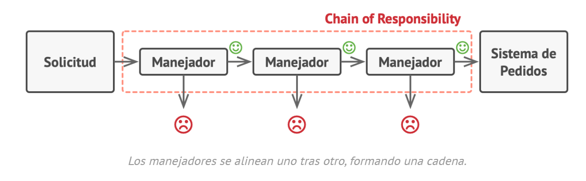

# Chain of Responsibility
## Patrón de comportamiento

#### La solicitud de un cliente pasa a lo largo de una serie de manejadores.
#### Cada manejador/procesador decide si procesa o no la solicitud, y si
#### la pasa o no al siguiente manejador.
#### Útil cuando hay que hacer una serie de comprobaciones o transformaciones secuenciales.

#### Ventajas:
#### Reduce el grado de acoplamiento
#### Se pueden cambiar los miembros o el orden de la cadena
#### Se pueden agregar nuevos miembros de la cadena muy fácilmente
#### Un manejador puede decidir no pasar la solicitud más allá por la cadena y detener con ello el procesamiento

#### Desventaja: difícil de debuggear

### Elementos:
#### Interfaz miembro o enlace de la cadena -> método para setear y obtener
#### en próximo enlace de la cadena y método para procesar la solicitud
#### Enlaces de la cadena-> clases concretas
#### Clase que organiza la cadena-> setea los miembros y su orden

